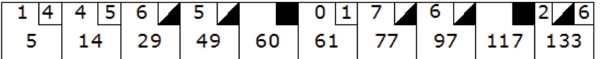

# BowlingGameKata

## Synopsis

This is a re-interpretation of Bob Martin's [Bowling Game Kata](http://butunclebob.com/ArticleS.UncleBob.TheBowlingGameKata) in ES2015.

The objective is to develop an algorithm to score a game of bowling, using test-driven development (TDD), writing only one test at a time, and letting that drive the evolution of the code.

See also [The Three Laws of TDD](http://butunclebob.com/ArticleS.UncleBob.TheThreeRulesOfTdd).

## Summary

The game consists of 10 frames as shown above.  In each frame the player has
two opportunities to knock down 10 pins.  The score for the frame is the total
number of pins knocked down, plus bonuses for strikes and spares.

A spare is when the player knocks down all 10 pins in two tries.  The bonus for
that frame is the number of pins knocked down by the next roll.  So in frame 3
above, the score is 10 (the total number knocked down) plus a bonus of 5 (the
number of pins knocked down on the next roll.)

A strike is when the player knocks down all 10 pins on his first try.  The bonus
for that frame is the value of the next two balls rolled.

In the tenth frame a player who rolls a spare or strike is allowed to roll the extra
balls to complete the frame.  However no more than three balls can be rolled in
tenth frame.

## How to Run

1. Clone the repo

        git clone git@github.com:PandaWhisperer/BowlingGameKata.git

2. Install packages

        npm install

3. Run tests

        npm test

4. That's all, folks!
